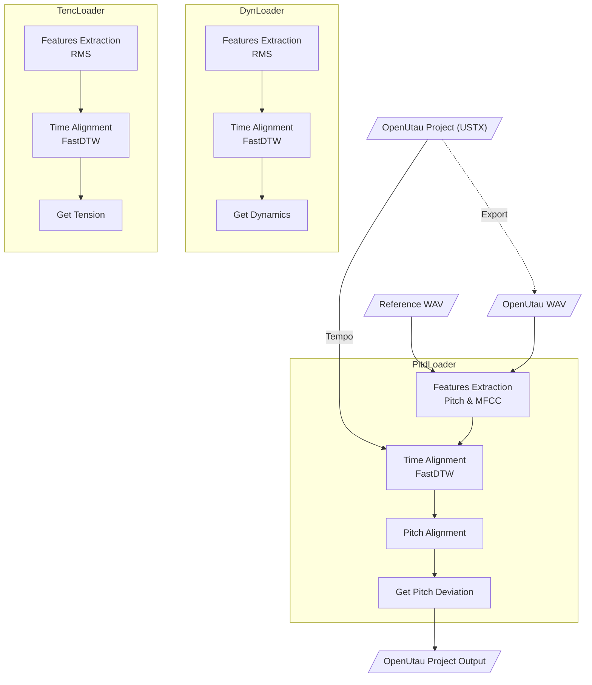

<p align="center">
   
</p>

<p align="center">
  <a href="README.md"></a>
  <a href="README.en.md"></a>
</p>

# Expressive

**Expressive** is a [DiffSinger](https://github.com/openvpi/diffsinger) expression parameter importer developed for [OpenUtau](https://github.com/stakira/OpenUtau). It aims to extract emotional parameters from real human vocals and import them into the appropriate tracks of your project.

The current version supports importing the following expression parameters:

* `Dynamics (curve)`
* `Pitch Deviation (curve)`
* `Tension (curve)`

https://github.com/user-attachments/assets/4b5b7c15-947a-4f54-b80e-a14a9eefc86b

> - *OpenUtau version used from [keirokeer/OpenUtau-DiffSinger-Lunai](https://github.com/keirokeer/OpenUtau-DiffSinger-Lunai)*
> - *Singer model from [yousa-ling-official-production/yousa-ling-diffsinger-v1](https://github.com/yousa-ling-official-production/yousa-ling-diffsinger-v1)*

## ✅ Supported Platforms

* Windows / Linux
* OpenUtau Beta (or other versions with DiffSinger support)
* Python 3.10 \*

By default, this application uses [swift-f0](https://github.com/lars76/swift-f0) (based on ONNX Runtime) as the pitch extraction backend, which runs on CPU only and satisfies basic usage scenarios.

The classic [CREPE](https://github.com/marl/crepe) pitch extraction backend (depends on TensorFlow) is also available, which suits for scenarios with higher accuracy requirements. If your computer is equipped with an NVIDIA GPU and supports [CUDA 11.x](https://docs.nvidia.com/deploy/cuda-compatibility/minor-version-compatibility.html) (i.e., GPU driver version >= 450), the CREPE backend will automatically enable GPU acceleration.

> \* On Windows, TensorFlow 2.10 is the last version that supports GPU acceleration, and Python 3.10 is the highest Python version supported by its `.whl` files.

## 📌 Use Case

### Need

When using a DiffSinger virtual singer for covers, users often already have an OpenUtau project with lyrics and pitch track but without expression parameters. This tool extracts expression parameters from a reference vocal and imports them into the OpenUtau project.

### Inputs

* **Virtual vocal**: Emotionless synthesized vocal output from OpenUtau (WAV format). It's recommended to keep `Tempo` and segmentation as close to the reference vocal as possible.
* **Reference vocal**: Original human vocal recording (WAV format). You can use tools like [UVR](https://github.com/Anjok07/ultimatevocalremovergui) to remove instrumental and reverb.
* **Input project**: Original OpenUtau project file (USTX format).
* **Output path**: Where the new processed project file will be saved.

### Output

A new USTX file with expression parameters added. The original project will not be modified.

## ✨ Features

* [x] Windows support
* [x] Linux support
* [x] NVIDIA GPU acceleration
* [x] Parameter config import/export
* [x] `Pitch Deviation` generation
* [x] `Dynamics` generation
* [x] `Tension` generation

## ⚠️ Known Issues

1. The current version does not support tempo changes within a single track. It’s recommended to use a consistent tempo throughout the project. This limitation will be addressed in future updates.

## 🚀 Direct Install

You can download pre-compiled executable files directly from the [Releases](https://github.com/NewComer00/expressive/releases) page:

### `Expressive-GUI-<version>-Windows-x64-CPU.exe`

GUI installer for Windows x64 architecture.

CPU-only, no CUDA runtime libraries included. Small installation size, but slower when using the CREPE backend for pitch extraction.

### `Expressive-GUI-<version>-Windows-x64-GPU.exe`

GUI installer for Windows x64 architecture with GPU support.

Includes CUDA runtime libraries. When used on a computer with an NVIDIA GPU (driver version >= 450), it significantly improves CREPE backend inference speed.

## 👨‍💻 Install from Source

### Clone the repository

> [!IMPORTANT]
> This project uses [Git LFS](https://git-lfs.com/) to store large files such as example audio under `examples/`. Please ensure Git LFS is installed on your system before cloning.

```bash
git clone https://github.com/NewComer00/expressive.git --depth 1
cd expressive
```

### Install the application

Install the package and its dependencies in a virtual environment:

```bash
pip install -e ".[gpu,gui]"
```

> [!TIP]
> - The `-e` flag installs in editable mode, useful for further development
> - Optional dependency groups available:
>   - `gpu`: GPU acceleration dependencies (e.g., CUDA runtime libraries)
>   - `gui`: Graphical user interface dependencies (e.g., NiceGUI)
>   - `dev`: Development dependencies (e.g., pytest testing framework)
>   - `all`: Install all of the above

After installation, you can use the `expressive` and `expressive-gui` entry points to run the command-line interface and graphical user interface.

## 📖 Usage

### Command Line Interface (CLI)

Display help:

```bash
expressive --help
```

Run example in Windows PowerShell:

```powershell
expressive `
  --utau_wav "examples/明天会更好/utau.wav" `
  --ref_wav "examples/明天会更好/reference.wav" `
  --ustx_input "examples/明天会更好/project.ustx" `
  --ustx_output "examples/明天会更好/output.ustx" `
  --track_number 1 `
  --expression dyn `
  --expression pitd `
  --pitd.semitone_shift 0 `
  --expression tenc
```

Run example in Linux shell:

```bash
expressive \
  --utau_wav "examples/明天会更好/utau.wav" \
  --ref_wav "examples/明天会更好/reference.wav" \
  --ustx_input "examples/明天会更好/project.ustx" \
  --ustx_output "examples/明天会更好/output.ustx" \
  --track_number 1 \
  --expression dyn \
  --expression pitd \
  --pitd.semitone_shift 0 \
  --expression tenc
```

The output project file will be saved to `examples/明天会更好/output.ustx`.

### Graphical User Interface (GUI)

Launch in English:

```bash
expressive-gui --lang en
```

> [!IMPORTANT]
> Due to framework limitations, the GUI launched via the `expressive-gui` command currently **does not support drag-and-drop**. To use drag-and-drop, please install the GUI [directly](#-direct-install), or run `expressive_gui.py` as a script:
> 
> ```bash
> python expressive_gui.py --lang en
> ```

## 🔬 Algorithm Workflow


