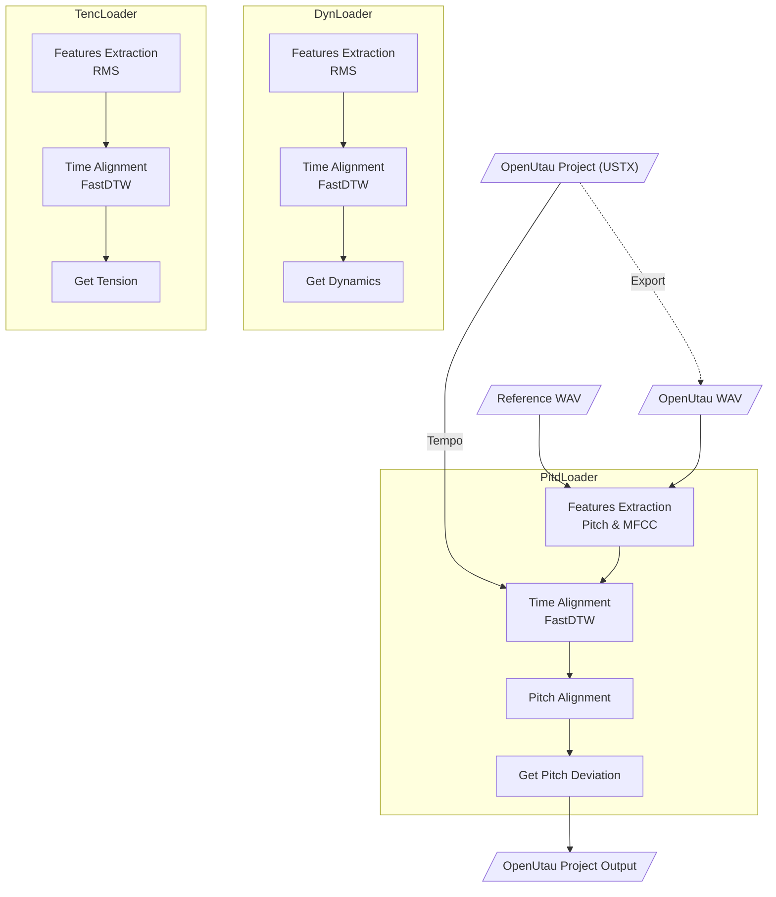

<p align="center">
   
</p>

<p align="center">
  <a href="README.md"></a>
  <a href="README.en.md"></a>
</p>

# Expressive

**Expressive** 是一个为 [OpenUtau](https://github.com/stakira/OpenUtau) 开发的 [DiffSinger](https://github.com/openvpi/diffsinger) 表情参数导入工具，旨在从真实人声中提取表情参数，并导入至工程的相应轨道。

当前版本支持以下表情参数的导入：

* `Dynamics (curve)`
* `Pitch Deviation (curve)`
* `Tension (curve)`

https://github.com/user-attachments/assets/4b5b7c15-947a-4f54-b80e-a14a9eefc86b

> - *OpenUtau 版本来自 [keirokeer/OpenUtau-DiffSinger-Lunai](https://github.com/keirokeer/OpenUtau-DiffSinger-Lunai)*
> - *歌手模型来自 [yousa-ling-official-production/yousa-ling-diffsinger-v1](https://github.com/yousa-ling-official-production/yousa-ling-diffsinger-v1)*

## ✅ 支持平台

* Windows / Linux
* OpenUtau Beta（或支持 DiffSinger 的其他版本）
* Python 3.10 \*

本应用默认选择 [swift-f0](https://github.com/lars76/swift-f0)（基于 ONNX Runtime）作为音高提取后端，仅需 CPU 即可运行，可满足基础使用场景。

也提供了经典的 [CREPE](https://github.com/marl/crepe)（依赖 TensorFlow）音高提取后端，适合更高要求的使用场景。若您的电脑配有 NVIDIA 显卡且支持 [CUDA 11.x](https://docs.nvidia.com/deploy/cuda-compatibility/minor-version-compatibility.html)（即显卡驱动版本 >= 450），使用 CREPE 后端时会自动启用 GPU 加速。

> \* 在 Windows 平台下，TensorFlow 2.10 是最后一个支持 GPU 加速的版本，Python 3.10 是它的 `.whl` 文件支持的最高 Python 版本。

## 📌 使用场景

### 需求

在使用 DiffSinger 虚拟歌手翻唱时，已经完成了填好词的无参 OpenUtau 工程，但尚未添加表情参数。本应用可以从参考人声音频中提取表情参数，并导入至 OpenUtau 工程中。

### 输入

* **歌姬音声**：由 OpenUtau 输出的无表情虚拟歌声音频（WAV 格式）。建议节奏 (`Tempo`) 和分段尽量与参考人声一致。
* **参考人声**：原始人声录音（WAV 格式），可使用 [UVR](https://github.com/Anjok07/ultimatevocalremovergui) 等工具去除伴奏与混响。
* **输入工程**：原始 OpenUtau 工程文件（USTX 格式）。
* **输出路径**：处理完成后新工程文件的保存位置。

### 输出

一个携带表情参数的新 USTX 文件。原始工程不会被修改。

## ✨ 功能特性

* [x] Windows 支持
* [x] Linux 支持
* [x] NVIDIA GPU 加速
* [x] 参数配置导入 / 导出
* [x] `Pitch Deviation` 参数生成
* [x] `Dynamics` 参数生成
* [x] `Tension` 参数生成

## ⚠️ 已知问题

1. 当前版本尚不支持单一轨道中的 `Tempo` 变化，建议工程全程使用统一节奏。该限制将在未来版本中解决。

## 🚀 直接安装

您可以直接在 [Releases](https://github.com/NewComer00/expressive/releases) 页面下载预编译的可执行文件:

### `Expressive-GUI-<version>-Windows-x64-CPU.exe`
适用于 x64 架构 Windows 的图形用户界面安装包。

仅可使用 CPU，无 CUDA 运行时库。安装体积小，但选择 CREPE 后端提取音高时速度较慢。

### `Expressive-GUI-<version>-Windows-x64-GPU.exe`
带 GPU 支持的适用于 x64 架构 Windows 的图形用户界面安装包。

含 CUDA 运行时库。在配备 NVIDIA 显卡（驱动版本 >= 450）的电脑上使用时，会大幅提高 CREPE 后端的推理速度。

## 👨‍💻 源码安装

### 克隆仓库

> [!IMPORTANT]
> 本项目使用 [Git LFS](https://git-lfs.com/) 存储 `examples/` 下的示例音频等大文件。克隆仓库前，请确保本地已正确安装 Git LFS。

```bash
git clone https://github.com/NewComer00/expressive.git --depth 1
cd expressive
```

### 安装应用

请在虚拟环境中安装本软件包及其依赖：

```bash
pip install -e ".[gpu,gui]"
```

> [!TIP]
> - `-e` 参数以可编辑模式安装，便于二次开发
> - 本软件包支持的可选依赖项包括：
>   - `gpu`：启用 GPU 加速相关依赖（如 CUDA 运行时库）
>   - `gui`：启用图形用户界面相关依赖（如 NiceGUI）
>   - `dev`：开发环境依赖（如测试框架 pytest）
>   - `all`：安装上述所有依赖项

安装完成后，您将能够使用 `expressive` 和 `expressive-gui` 两个入口点来运行命令行界面和图形用户界面。

## 📖 使用方式

### 命令行界面（CLI）

显示帮助信息

```bash
expressive --help
```

在 Windows PowerShell 中执行示例命令

```powershell
expressive `
  --utau_wav "examples/明天会更好/utau.wav" `
  --ref_wav "examples/明天会更好/reference.wav" `
  --ustx_input "examples/明天会更好/project.ustx" `
  --ustx_output "examples/明天会更好/output.ustx" `
  --track_number 1 `
  --expression dyn `
  --expression pitd `
  --pitd.semitone_shift 0 `
  --expression tenc
```

在 Linux Shell 中执行示例命令

```bash
expressive \
  --utau_wav "examples/明天会更好/utau.wav" \
  --ref_wav "examples/明天会更好/reference.wav" \
  --ustx_input "examples/明天会更好/project.ustx" \
  --ustx_output "examples/明天会更好/output.ustx" \
  --track_number 1 \
  --expression dyn \
  --expression pitd \
  --pitd.semitone_shift 0 \
  --expression tenc
```

输出工程文件将保存在 `examples/明天会更好/output.ustx`。

### 图形用户界面（GUI）

启动中文界面

```bash
expressive-gui --lang zh_CN
```

> [!IMPORTANT]
> 由于框架限制，通过 `expressive-gui` 命令启动的图形界面目前**不支持文件拖放**功能。若需使用拖放功能，请[直接安装](#-直接安装)本应用，或以脚本方式运行 `expressive_gui.py`：
> 
> ```bash
> python expressive_gui.py --lang zh_CN
> ```

## 🔬 算法流程

